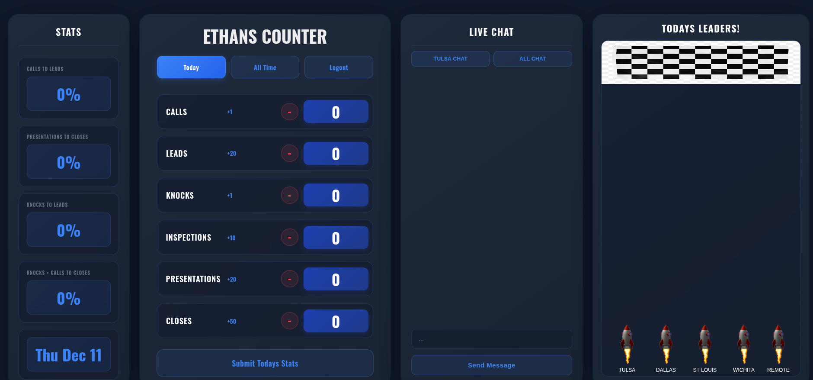

# Sales Counter App

Counter application for tracking daily sales stats. Been working on this to help track team performance metrics.

## What it does

- Track daily stats: calls, leads, knocks, inspections, presentations, closes
- Increment/decrement counters with audio feedback
- View today's stats or all-time totals
- LocalStorage persistence that auto-resets daily at midnight
- WebSocket live chat for team communication
- Office-based team race/competition view

## Features

**Counter Interface**
- Click to increment stats, minus button to decrement
- Points system per action (calls +1, leads +20, closes +50, etc.)
- Switch between "Today" and "All Time" views
- Modal confirmation before submitting daily stats

**WebSocket Chat**
- Real-time messaging between team members
- Office-specific chat channels
- Audio notification on message send/receive

**Team Race**
- Canvas-based visualization showing office performance
- Tracks Tulsa, Dallas, St Louis, Wichita, Remote offices

## Auth
wrote the auth for this without nextauth or 3rd party service , pretty basic auth check,
passWords are hashed stored in sqlLite db on account creation, have not added any JWT stuff or anything yet

